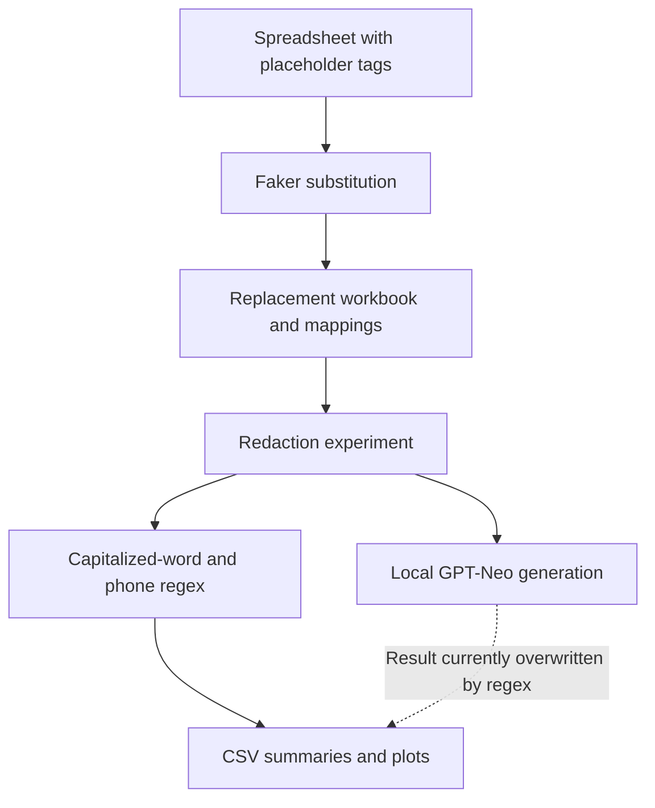

# Faker Text Lab

Python experiments for replacing tagged names and phone numbers with generated values, then exploring regex and local language-model redaction. The project combines spreadsheet processing, Faker-based substitution, and exploratory result reporting.

## What the scripts do

| Script | Purpose |
| --- | --- |
| `faker_replacement.py` | Replaces `<PERSON>` and `<PHONE_NUMBER>` tags in spreadsheet cells and adds replacement counts and mappings |
| `llm faker.py` | Runs a regex baseline and GPT-Neo experiments, logs outcomes, and writes result tables and charts |

The included [synthetic CSV](examples/synthetic-input.csv) illustrates the input tags without using any real records. It is an input-format example, not a recorded experiment result.

## Read and reproduce carefully

The stack is Python, pandas, Faker, PyTorch, Transformers, tqdm, Matplotlib, and seaborn; Excel I/O also needs a compatible engine such as openpyxl. No pinned dependency environment is supplied. The scripts are preserved as experiments with their existing paths and execution structure; see [usage and implementation notes](docs/EXPERIMENTS.md) before running them.

The replacement script reads `output156.xlsx` from its working directory and writes `faker_replaced_output.xlsx`. A synthetic workbook with an `Original_Text` column can be created from the example CSV. The second script expects the replacement workbook under `/mnt/data/`; review and adapt that local path in your own copy.

These are not validated anonymization tools. The redaction experiment retains original text and mappings in outputs, and its processing function overwrites the generated model result with regex output. Its current plots therefore cannot substantiate a model-quality comparison. Use fictional input only when exploring this snapshot.

No datasets, original notebooks, logs, model weights, or result charts are included. No model downloads, script execution, or new tests were performed for packaging. Original code by Ved Sarkar; see [attribution and license status](ATTRIBUTION.md).
